# Climate Change & Youth Cardiorespiratory Fitness

### A prototype research pipeline simulating the SUPER (Sustainable Sports and Physical Activity for Equity and Resilience) Horizon Europe project

---

## Overview

This project simulates a PhD research pipeline investigating how climate change
affects cardiorespiratory fitness (CRF) in children and adolescents, and how
physical activity can mitigate those effects.

Because no large-scale open dataset of youth CRF exists, the project generates
synthetic CRF data using realistic physiological assumptions, then trains
predictive models on the combined dataset to simulate future climate scenarios.

The full pipeline covers:

1. Data loading and inspection
2. Preprocessing and feature engineering
3. Multi-source dataset integration
4. Synthetic CRF generation
5. Machine learning model training and evaluation
6. Climate scenario simulation (+1°C, +2°C, +3°C)
7. Physical activity mitigation analysis
8. Interactive Streamlit dashboard

---
## Architecture

### Full pipeline



### Data integration



### Modelling and scenario simulation


---

## Research context

**Project**: SUPER — Sustainable Sports and Physical Activity for Equity and Resilience  
**Funding**: Horizon Europe  
**PhD title**: Forecasting Climate Change Effects on Cardiorespiratory Fitness in Children and Adolescents

### Research objectives

1. Compile and integrate cardiorespiratory fitness data with climate and socioeconomic data
2. Develop predictive models forecasting future impacts of climate change on CRF in youth
3. Quantify the mitigating role of physical activity in reducing the adverse effects of climate change on CRF

---

## Project structure

```
climate_crf_project/
│
├── data/
│   ├── raw/                        ← original source files (not tracked by git)
│   │   ├── data_stream-moda_stepType-avgad.csv     ERA5 precipitation
│   │   ├── data_stream-moda_stepType-avgua.csv     ERA5 temperature + dewpoint
│   │   ├── API_NY.GDP.PCAP.PP.CD_DS2_en_csv_v2_35.csv
│   │   ├── API_SP.URB.TOTL.IN.ZS_DS2_en_csv_v2_249.csv
│   │   ├── HEPA Data (table).csv
│   │   └── HEPA Data (pivoted).csv
│   └── processed/                  ← auto-generated by pipeline scripts
│       ├── era5_precip.csv
│       ├── era5_temp.csv
│       ├── era5_yearly.csv
│       ├── gdp_clean.csv
│       ├── urban_clean.csv
│       ├── hepa_clean.csv
│       ├── integrated.csv
│       └── dataset_with_crf.csv
│
├── src/
│   ├── __init__.py
│   ├── utils.py                    ← ISO3 country codes, name normalisation
│   ├── 01_load_data.py             ← inspect raw files
│   ├── 02_preprocess.py            ← clean, derive features, aggregate ERA5
│   ├── 03_integrate.py             ← merge all sources on country + year
│   ├── 04_generate_crf.py          ← synthetic VO2max / CRF generation
│   ├── 05_train_model.py           ← train and evaluate ML models
│   └── 06_simulate_scenarios.py    ← climate and PA scenario simulation
│
├── models/                         ← saved model artifacts (joblib)
│   ├── linear_regression.pkl
│   ├── random_forest.pkl
│   ├── xgboost.pkl
│   ├── scaler.pkl
│   └── features.pkl
│
├── outputs/                        ← generated plots and evaluation CSVs
│   ├── feature_importance.png
│   ├── climate_scenarios.png
│   ├── mitigation_analysis.png
│   └── model_evaluation.csv
│
├── dashboard/
│   └── app.py                      ← Streamlit interactive dashboard
│
├── requirements.txt
└── README.md
```

---

## Data sources

| Dataset | Source | Variables used |
|---|---|---|
| ERA5 monthly reanalysis (avgad) | Copernicus Climate Data Store | Total precipitation (tp) |
| ERA5 monthly reanalysis (avgua) | Copernicus Climate Data Store | 2m temperature (t2m), dewpoint (d2m) |
| GDP per capita PPP | World Bank Open Data | gdp_per_capita |
| Urban population % | World Bank Open Data | urban_pop_pct |
| HEPA policy indicators | WHO Europe / HEPA Europe | pa_policy_score |

### ERA5 derived variables

From `t2m` and `d2m` the pipeline computes:

- `avg_temp_c` — mean annual 2m air temperature (°C)
- `avg_rh_pct` — relative humidity (%) via the Magnus formula
- `avg_wbgt` — wet-bulb globe temperature proxy (°C), the physiologically
  relevant heat stress metric used in exercise science
- `heat_stress` — WBGT normalised to [0, 1] for use as a model feature

---

## Synthetic CRF methodology

No open large-scale dataset of youth cardiorespiratory fitness exists.
CRF values are therefore generated using a formula grounded in published
exercise physiology literature:

```
VO2max = 42
       + 8.0 × PA_norm           physical activity policy score
       + 3.0 × GDP_norm          socioeconomic resources
       − 3.5 × temp_norm         warmer baseline climate
       − 4.5 × heat_stress_norm  physiological heat strain (WBGT)
       − 1.5 × humidity_norm     added strain from humidity
       − 2.0 × urban_norm        sedentary urban lifestyle
       + N(0, 2.5)               individual biological variation
```

Output is clipped to the realistic youth range of **30–60 ml/kg/min**.

Two further variables are derived from VO2max:
- `crf_score` — normalised fitness score (0–100 scale)
- `shuttle_run_equiv` — 20m shuttle run lap equivalent (22–105 laps)

> **Important**: Because CRF is synthetic, model R² values will be high
> (0.85–0.99). This reflects that the model is recovering a known formula,
> not genuine predictive power on real data. In a full research study, CRF
> values would come from school fitness test databases (e.g. EUROFIT,
> FitnessGram) and R² would be lower and more meaningful.

---

## Models

Three models are trained and compared:

| Model | Notes |
|---|---|
| Linear Regression | Baseline; features standardised with StandardScaler |
| Random Forest | 300 trees, max depth 6; robust to feature scale differences |
| XGBoost | 300 rounds, learning rate 0.05; typically best performer |

Evaluation metrics: **R²** and **RMSE** (ml/kg/min) on a held-out 20% test set.
All model artifacts are saved to `models/` using joblib.

---

## Climate scenarios

The simulation module perturbs climate features and uses the trained Random
Forest model to predict resulting CRF changes:

| Scenario | Temperature change | Heat stress change |
|---|---|---|
| Baseline | +0°C | — |
| Scenario 1 | +1°C | +0.05 per °C |
| Scenario 2 | +2°C | +0.10 per °C |
| Scenario 3 | +3°C | +0.15 per °C |

---

## Mitigation analysis

Physical activity mitigation is simulated by boosting `pa_policy_score`
while holding temperature constant at +2°C:

| Scenario | Temperature | PA level |
|---|---|---|
| A | +2°C | Current |
| B | +2°C | +20% |

The difference in predicted mean VO2max between A and B quantifies how much
of the climate-driven CRF decline can be recovered through increased physical
activity.

---

## Installation

**Requirements**: Python 3.10 or 3.11

```bash
# Clone or download the project, then:
cd climate_crf_project

# Create and activate a virtual environment
python -m venv venv
source venv/bin/activate          # Windows: venv\Scripts\activate

# Install dependencies
pip install -r requirements.txt
```

---

## Running the pipeline

Run each script in order from the project root with the virtual environment active.

```bash
# 1. Inspect raw data files
python -m src.01_load_data

# 2. Preprocess all sources
#    ERA5 grid → country-year aggregates
#    World Bank wide → long format
#    HEPA ISO3 codes → country names + policy score
python -m src.02_preprocess

# 3. Merge all sources on country + year
python -m src.03_integrate

# 4. Generate synthetic CRF variables
python -m src.04_generate_crf

# 5. Train and evaluate ML models
python -m src.05_train_model

# 6. Run climate and mitigation scenario simulations
python -m src.06_simulate_scenarios

# 7. Launch the interactive dashboard
streamlit run dashboard/app.py
```

Total runtime for steps 1–6: approximately 5–15 minutes depending on the size
of your ERA5 files. The dashboard opens automatically in your browser at
http://localhost:8501.

---

## Dashboard

The Streamlit dashboard provides:

- **KPI cards** — baseline vs scenario mean VO2max with delta
- **VO2max distribution** — baseline vs scenario histogram overlay
- **Warming curve** — mean VO2max across +0°C to +4°C
- **Mitigation curves** — PA boost vs VO2max recovery at each warming level
- **Model selector** — switch between Random Forest, XGBoost, Linear Regression
- **Raw data explorer** — inspect the integrated dataset

Controls:
- Temperature increase slider (0–4°C in 0.5°C steps)
- Physical activity boost slider (0–50% in 5% steps)

---

## Limitations

- **Synthetic CRF**: all fitness values are modelled, not measured.
  Findings are illustrative, not empirical.
- **European scope**: HEPA data covers ~35 European countries only.
  The pipeline cannot make claims about global youth fitness.
- **ERA5 spatial aggregation**: country-level climate values are
  bounding-box averages of a 0.25° grid. Coastal and mountainous
  countries (Norway, Switzerland) will have higher variance.
- **HEPA as PA proxy**: the HEPA policy score measures national policy
  adoption, not actual population physical activity levels. It is a
  structural proxy, not a behavioural measure.
- **Static socioeconomic variables**: GDP and urban population change
  over time but their future trajectories are not modelled. Scenario
  simulations hold these constant at observed values.

---

## Potential extensions toward a full research study

- Replace synthetic CRF with real school fitness test data
  (EUROFIT, FitnessGram, national surveillance databases)
- Add age and sex stratification to the CRF model
- Incorporate CMIP6 climate projections for 2050 and 2100 horizons
- Use mixed-effects models to account for repeated country observations
- Add uncertainty quantification (prediction intervals) to scenario outputs
- Expand geographic scope beyond Europe using WHO global PA surveys
- Link to air quality data (PM2.5, ozone) as an additional CRF stressor

---

## Dependencies

```
pandas>=2.0
numpy>=1.24
scikit-learn>=1.3
xgboost>=2.0
matplotlib>=3.7
plotly>=5.15
streamlit>=1.28
joblib>=1.3
```

---

## License

This project is a research prototype developed for academic demonstration
purposes. Data sources are subject to their own terms:

- **ERA5**: Copernicus Climate Change Service licence
- **World Bank**: Creative Commons Attribution 4.0
- **HEPA**: WHO Europe / HEPA Europe open data